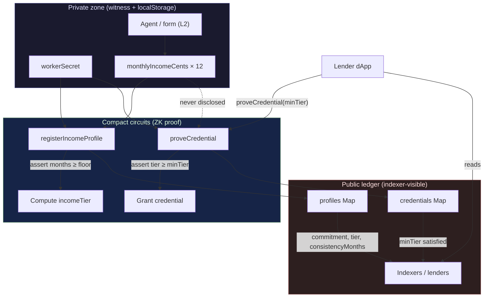

# Ghost Economy — Staged Build Plan

ZK-verified private proof-of-income for the gig economy on [Midnight Network](https://midnight.network). Workers prove income stability and eligibility thresholds without revealing amounts, platforms, or individual transactions. Financial institutions receive only the compliance signals they need; workers keep full data sovereignty.

**This document is the implementation roadmap.** Each level is independently submittable. Say **"go to Level N"** to implement that stage only — do not skip ahead.

| Level | Codename | Status | Trigger phrase |
|-------|----------|--------|----------------|
| L1 | New Moon | Complete | `go to Level 1` |
| L2 | Waxing Crescent | Complete | `go to Level 2` |
| L3 | First Quarter | Not started | `go to Level 3` |
| L4–L6 | Gibbous → Full Moon | Deferred | See §6 |

---

## 1. Vision Summary

From `idea.md`:

> **1.5 billion people** globally have income but no credit. Gig workers, freelancers, and informal-economy workers cannot get loans, leases, or financial services because they cannot prove income without violating privacy or exposing their entire financial history to strangers.
>
> **Ghost Economy** is a ZK income-verification protocol where agents aggregate private income streams (Uber, Upwork, Shopify, cash, etc.), generate a proof that *"this person earns above $X monthly, consistently, for Y months"* — without revealing the amount, the platforms, or specific transactions.
>
> Financial institutions query the proof and receive exactly the compliance signal they need. The user keeps full data sovereignty.
>
> Long-term: AI agents pattern-match consistency, seasonality, and risk from private data and surface them as verified attributes — not just "they earn X" but "their income has these stability properties."

**North star:** Privacy-native financial infrastructure for the informal global economy.

---

## 2. Vision vs Hackathon Reality

| Full vision (post-hackathon) | L1 — New Moon | L2 — Waxing Crescent | L3 — First Quarter | L4–L6 (defer) |
|------------------------------|---------------|----------------------|--------------------|---------------|
| AI agents scraping/aggregating platform APIs | Manual witness input (typed monthly amounts) | Same; UI form simulates "agent output" | Mock attestation JSON in witness | Real OAuth + agent pipeline |
| ML seasonality / risk attributes | Fixed in-circuit tier buckets (Bronze/Silver/Gold) | UI shows tier only, not raw months | Add `stabilityScore` coarse bucket | ONNX / off-chain model → attested witness |
| Multi-platform income merge | Single `Vector<12, Uint<32>>` witness | Platform count hidden; no per-platform ledger | Schnorr-signed attestation witness (zk-loan pattern) | Platform connectors |
| Institution query portal / API | Indexer reads public registry | Lender view: read tier + credential | `proveCredential` circuit for lenders | SaaS lender dashboard |
| Revocable / expiring credentials | Static registration | — | Credential map with `minTier` threshold | TTL, revocation, re-attestation |
| Payroll / NIGHT settlement | — | — | — | Private Payroll track |
| Mobile wallet (1AM) | — | Lace on Preprod (hackathon req) | Lace + CI badge | 1AM production path |
| Regulatory KYC linkage | — | — | — | Off-chain KYC → commitment only |

**Hackathon principle:** Ship the **privacy boundary** early (private income witness → public commitment + coarse tier). Defer AI, real platform integrations, and lender SaaS until L4+.

---

## 3. Level 1 — New Moon

**Mission:** Toolchain, first Compact contract, vitest harness, Preprod deploy, README. Nothing needs a frontend yet.

### 3.1 Target repository layout

Mirror [proof-of-mind](/home/fahmin/Documents/codes/midnight/proofofmind) structure:

```
ghosteconomy/
├── contracts/
│   ├── ghost-economy.compact       # L1 contract source
│   ├── witnesses.ts                # workerSecret, monthlyIncomeCents witnesses
│   ├── index.ts                    # CompiledContract barrel + zkConfigPath
│   └── managed/ghost-economy/      # compact compile output (commit keys/zkir)
├── src/
│   ├── config.ts                   # local / preprod endpoints
│   ├── wallet.ts                   # MidnightWalletProvider + syncWallet
│   ├── providers.ts                # proof + indexer + private state providers
│   ├── deploy-preprod.ts           # WALLET_SEED deploy script
│   └── test/
│       └── ghost-economy.test.ts   # vitest: deploy + registerIncomeProfile
├── scripts/
│   └── setup-l1.sh                 # one-command L1 verify (like proof-of-mind)
├── compose.yml                     # node + indexer + proof-server (local devnet)
├── package.json
├── tsconfig.json
├── vitest.config.ts
├── deployment.json                 # written by deploy:preprod (gitignore or commit example)
├── README.md
└── idea.md                         # already exists
```

### 3.2 Pinned toolchain versions

| Component | Version | Verify command |
|-----------|---------|----------------|
| Node.js | ≥ 22.0.0 | `node --version` |
| Yarn | 1.22.x | `yarn --version` |
| Compact compiler | **0.31.1** | `compact update 0.31.1 && compact compile --version` |
| `@midnight-ntwrk/compact-runtime` | **0.16.0** | `yarn list --pattern compact-runtime` |
| `@midnight-ntwrk/midnight-js-*` | **4.0.4** | package.json |
| `@midnight-ntwrk/ledger-v8` | **8.0.3** | package.json |
| `@midnight-ntwrk/testkit-js` | **4.0.4** | package.json |
| Proof server Docker image | `midnightntwrk/proof-server:8.0.3` | port 6300 |

Copy dependency block from `/home/fahmin/Documents/codes/midnight/proofofmind/package.json` — same pins, rename package to `ghost-economy`.

### 3.3 L1 contract design

**File:** `contracts/ghost-economy.compact`

**Privacy model (L1):**

| Data | Visibility | Where |
|------|------------|-------|
| `workerSecret` | **Private** | Witness + localStorage (later) |
| `monthlyIncomeCents` (12 months) | **Private** | Witness only |
| `profileCommitment` | **Public** | `profiles` map key |
| `workerCommitment` | **Public** | `ProfileEntry.workerCommitment` |
| `incomeTier` (0–3 enum bucket) | **Public** | `ProfileEntry.incomeTier` |
| `consistencyMonths` (count ≥ threshold) | **Public** | `ProfileEntry.consistencyMonths` |

Raw dollar amounts and per-platform splits **never** touch the ledger.

**Ledger state:**

```compact
struct ProfileEntry {
  workerCommitment: Bytes<32>,
  incomeTier: Uint<8>,           // 0=unverified, 1=bronze, 2=silver, 3=gold
  consistencyMonths: Uint<8>     // months above disclosed floor (not the floor itself)
}

export ledger profiles: Map<Bytes<32>, ProfileEntry>;
export ledger nextProfileId: Counter;
```

**Witnesses:**

```compact
witness workerSecret(): Bytes<32>;
witness monthlyIncomeCents(): Vector<12, Uint<32>>;
```

**Circuits (L1 only — 2 circuits):**

| Circuit | Purpose |
|---------|---------|
| `workerCommitment(sk: Bytes<32>): Bytes<32>` | `persistentHash` with domain `"ge:worker:"` |
| `profileCommitment(incomes: Vector<12, Uint<32>>): Bytes<32>` | `persistentHash` with domain `"ge:profile:"` |
| `registerIncomeProfile(minMonthlyCents: Uint<32>, requiredMonths: Uint<8>): []` | Validates witness incomes ≥ floor for `requiredMonths` consecutive months; computes tier in-circuit; inserts `ProfileEntry` with disclosed commitments + coarse metrics |

**`registerIncomeProfile` logic (in-circuit):**

1. Read `sk = workerSecret()`, `incomes = monthlyIncomeCents()` (private).
2. `assert` each compared month uses `Uint<0..>` ordering — **do not** disclose individual month values.
3. Count consecutive months where `income >= minMonthlyCents`; `assert(count >= requiredMonths)`.
4. Map average (or min) into tier: e.g. bronze if floor met 3mo, silver 6mo, gold 12mo — thresholds are **circuit constants**, not witness leaks.
5. `profileCommit = profileCommitment(incomes)`, `workerCommit = workerCommitment(sk)`.
6. `profiles.insert(disclose(profileCommit), ProfileEntry { ... })`.

**`disclose()` usage:** Only on map keys, struct fields written to ledger, and circuit arguments that are intentionally public (`minMonthlyCents`, `requiredMonths` are **public transcript** — acceptable for L1 demo; document that lenders learn the floor the worker chose to prove against).

**L1 explicitly defers:** `proveOwnership`, `proveCredential`, Schnorr attestation, nullifiers.

### 3.4 Witness TypeScript

**File:** `contracts/witnesses.ts`

- `createInitialPrivateState(workerSecret, monthlyIncomeCents)` — 12-element `Uint32Array`.
- Implement `Witnesses<typeof GhostEconomy>` callbacks.
- Test fixtures: Alice secret `0x01…`, incomes `[250000, 250000, …]` (=$2,500/mo in cents).

### 3.5 Test harness

**File:** `src/test/ghost-economy.test.ts`

Pattern: copy from `/home/fahmin/Documents/codes/midnight/proofofmind/src/test/proof-of-mind.test.ts`.

| # | Test name | Asserts |
|---|-----------|---------|
| 1 | `deploys contract` | `contractAddress` defined |
| 2 | `registers income profile` | `profiles.member(expectedCommitment)` |
| 3 | `rejects duplicate profile` | second `registerIncomeProfile` throws |
| 4 | `rejects insufficient consistency` | low-income witness fails assert |

Run: `yarn setup:l1` or `yarn compile && yarn env:up && yarn test:local`.

### 3.6 Deploy

**File:** `src/deploy-preprod.ts`

- `export WALLET_SEED="<funded-preprod-seed>"`
- `yarn deploy:preprod` → writes `deployment.json` with `contractAddress`.
- Fund via [Preprod faucet](https://faucet.preprod.midnight.network).

### 3.7 README checklist (L1 submission)

- [ ] Product idea paragraph (from §1)
- [ ] Prerequisites + Compact 0.31.1 install
- [ ] `yarn setup:l1` one-command setup
- [ ] **Public state vs private witness** table (§3.3)
- [ ] Circuits list
- [ ] Screenshot: `yarn compile` listing circuits
- [ ] Screenshot: `yarn test:local` passing
- [ ] Screenshot: deploy output with contract address
- [ ] Hackathon level table (L1 complete)

### 3.8 Commit strategy (minimum 5 meaningful commits)

| # | Message (example) | Contents |
|---|-------------------|----------|
| 1 | `chore: scaffold ghost-economy monorepo` | `package.json`, `tsconfig`, `compose.yml`, `.gitignore` |
| 2 | `feat(contract): add ghost-economy.compact with registerIncomeProfile` | `.compact`, `witnesses.ts`, `index.ts` |
| 3 | `feat: add wallet providers and vitest harness` | `src/config.ts`, `wallet.ts`, `providers.ts`, test file |
| 4 | `feat: add setup-l1 script and preprod deploy` | `scripts/setup-l1.sh`, `deploy-preprod.ts` |
| 5 | `docs: L1 README with privacy model and setup` | `README.md`, compile/test screenshots referenced |

### 3.9 L1 success criteria

- [ ] `compact compile +0.31.1` succeeds; `contracts/managed/ghost-economy/` contains `keys/` + `zkir/`
- [ ] 4 vitest tests pass on local devnet
- [ ] Contract deployed to Preprod; address in `deployment.json`
- [ ] README explains what observers can/cannot learn
- [ ] ≥ 5 commits on public GitHub

**Stop here for L1 submission.** Do not add `web/` until Level 2.

---

## 4. Level 2 — Waxing Crescent

**Mission:** React + Vite frontend, Lace wallet on Preprod, call `registerIncomeProfile` from UI, demonstrate observable privacy.

**Prerequisite:** L1 complete and verified.

### 4.1 Additional layout

```
web/
├── package.json
├── vite.config.ts
├── index.html
├── public/zk/ghost-economy/          # synced via scripts/sync-zk-assets.mjs
└── src/
    ├── main.tsx
    ├── App.tsx
    └── lib/
        ├── midnight.ts             # DApp Connector: detect, connect, disconnect
        ├── contract.ts             # CompiledContract loader
        └── ghost-economy.ts        # deploy, registerIncomeProfile, fetchRegistry
scripts/
└── sync-zk-assets.mjs              # contracts/managed → web/public/zk
```

### 4.2 Frontend behavior

| UI section | Behavior |
|------------|----------|
| Wallet bar | Lace connect / disconnect on **preprod** |
| Deploy / Join | Deploy new contract or paste `deployment.json` address |
| Income form | 12 monthly inputs (private — never sent to indexer) |
| Proof params | `minMonthlyCents`, `requiredMonths` (public args — explain in UI) |
| Submit | Calls `registerIncomeProfile` via wallet |
| Public registry | Indexer poll: show `profileCommitment` (truncated), `incomeTier`, `consistencyMonths` only |

**Observable privacy behavior (submission requirement):** User enters exact monthly amounts in the form. After tx confirms, the registry table shows **tier label + consistency count** but **no dollar amounts**. Demo video: fill $3,200/mo → chain shows "Gold, 12 months" only.

### 4.3 L2 contract changes

**None required** if L1 contract is complete. Optional polish:

- Export `incomeTierLabel` helper in TypeScript (off-chain decode), not new circuit.

### 4.4 Scripts

```bash
yarn sync:zk
cd web && yarn install && yarn dev   # http://localhost:5173
```

Deploy frontend to Vercel/Netlify; set `VITE_INDEXER_URL` for Preprod.

### 4.5 README additions (L2)

- [ ] Live demo link
- [ ] Preprod contract address (verifiable)
- [ ] **Privacy claim** section: what Lace + indexer observer learns
- [ ] Demo video: wallet connect + circuit call
- [ ] ≥ 8 total meaningful commits

### 4.6 L2 commit strategy (3+ new commits)

| # | Message | Contents |
|---|---------|----------|
| 6 | `feat(web): scaffold Vite app with Lace connector` | `web/` shell, `midnight.ts` |
| 7 | `feat(web): income registration UI and registry table` | `App.tsx`, `ghost-economy.ts` |
| 8 | `feat: sync-zk-assets and document L2 demo` | `sync-zk-assets.mjs`, README demo link |

### 4.7 L2 success criteria

- [ ] Lace connect/disconnect works on Preprod
- [ ] `registerIncomeProfile` succeeds from browser
- [ ] Registry shows tier without amounts (privacy demo)
- [ ] Live URL + demo video
- [ ] ≥ 8 total commits

**Stop here for L2 submission.**

---

## 5. Level 3 — First Quarter

**Mission:** Production-grade dApp, ≥ 3 tests, CI/CD, map to **one approved hackathon idea**.

### 5.1 Approved idea mapping

**Selected track: [Confidential Credentials](https://github.com/midnightntwrk)** — *"prove a credential is valid without disclosing it."*

| Hackathon idea requirement | Ghost Economy implementation |
|----------------------------|------------------------------|
| Credential exists | Worker registers income profile (commitment on-chain) |
| Credential is valid | `proveCredential(profileCommitment, minTier)` — ZK proof tier ≥ lender minimum |
| Without disclosing it | Raw `monthlyIncomeCents` witness never revealed; lender sees only `minTier` arg + proof success |
| Observer value | Lender learns "meets ≥ Silver" not "earns $4,127/mo on Upwork" |

**Product proposal text (submit for approval):**

> Ghost Economy — Confidential Credentials for income: gig workers hold a private income witness; on-chain they register a commitment and coarse tier. Lenders call `proveCredential` with a minimum tier threshold and receive a ZK verification that the worker's private income history satisfies eligibility — without accessing amounts, platforms, or transaction details.

Secondary pattern (documentation only): **Age / Eligibility Gate** — `minMonthlyCents` + `requiredMonths` are threshold proofs without revealing underlying values.

### 5.2 L3 contract additions

**File:** `contracts/ghost-economy.compact` (extend)

**New ledger:**

```compact
export ledger credentials: Map<Bytes<32>, Uint<8>>;  // profileCommitment → minTier granted
```

**New witnesses:** (unchanged)

**New circuits:**

| Circuit | Purpose |
|---------|---------|
| `proveOwnership(targetProfileCommitment: Bytes<32>): []` | `workerCommitment(workerSecret())` matches stored entry (worker auth) |
| `proveCredential(targetProfileCommitment: Bytes<32>, minTier: Uint<8>): []` | Worker proves ownership + `incomeTier >= minTier`; inserts `credentials[profileCommit] = minTier` |

**L3 circuit count:** 5 total (`workerCommitment`, `profileCommitment`, `registerIncomeProfile`, `proveOwnership`, `proveCredential`).

### 5.3 L3 tests (minimum 4)

**File:** `src/test/ghost-economy.test.ts`

| # | Test |
|---|------|
| 1–4 | L1 tests (still pass) |
| 5 | `proveOwnership` succeeds for registered worker |
| 6 | `proveCredential` writes `credentials` when tier sufficient |
| 7 | `proveCredential` fails when `minTier` above worker tier |

### 5.4 CI/CD

**File:** `.github/workflows/ci.yml`

```yaml
# Pattern from proof-of-mind — compile + test:local on ubuntu-latest
# Services: docker compose node + indexer + proof-server
# Steps: checkout → Node 22 → compact 0.31.1 → yarn install → yarn compile → yarn test:local
```

Add CI badge to README.

### 5.5 L3 frontend additions

| Feature | Description |
|---------|-------------|
| Lender mode | Input `profileCommitment` + `minTier` → call `proveCredential` |
| Credential badge | Show `credentials` map entries from indexer |
| Privacy model page | README section: observer / lender / worker views |

### 5.6 README “privacy model” section (L3)

Document three observer classes:

| Observer | Can learn | Cannot learn |
|----------|-----------|--------------|
| Chain indexer | Profile commitments, tiers, consistency month counts, credential thresholds granted | Monthly amounts, platforms, employer names |
| Lender | That `proveCredential` succeeded for `minTier` | Exact income, income sources |
| Worker | Everything locally | — |

### 5.7 L3 commit strategy (2+ new commits, ≥ 10 total)

| # | Message | Contents |
|---|---------|----------|
| 9 | `feat(contract): proveOwnership and proveCredential circuits` | L3 Compact + witnesses |
| 10 | `ci: add GitHub Actions workflow and lender UI` | `.github/workflows/ci.yml`, web lender panel |
| 11 | `docs: privacy model and Confidential Credentials proposal` | README L3 sections |

### 5.8 L3 success criteria

- [ ] 7 tests passing locally + CI green
- [ ] Confidential Credentials proposal submitted
- [ ] 1-minute demo video: worker register → lender prove credential
- [ ] README privacy model complete
- [ ] ≥ 10 total commits

**Stop here for L3 submission.**

---

## 6. Levels 4–6 Roadmap (Deferred)

Brief scope for hackathon **idea submission** (L4 gate) — do not implement until L3 approved.

| Level | Theme | Deferred deliverables |
|-------|-------|----------------------|
| **L4 — Waxing Gibbous** | Attestation layer | Schnorr module (`schnorr.compact` from zk-loan skill); off-chain **Income Attestation API** signs `{ incomes, tier, workerCommit }`; witness `getAttestedIncomeWitness()` |
| **L5 — Full Moon** | Agent + platforms | Mock agent service normalizes Uber/Upwork CSV → witness vector; revocation + expiry on `credentials`; 1AM wallet path |
| **L6 — Eclipse / Production** | Lender integration | Institution read-only API; selective disclosure packs; audit log; mainnet/multinetwork deploy via `multinetwork/` skill |

**L4 idea pitch (for submission form):** Extend Confidential Credentials with third-party payroll attestation (Schnorr), keeping platform-level data off-chain.

---

## 7. Contract Design Summary by Level

| Level | Circuits | Ledger fields | Witnesses |
|-------|----------|---------------|-----------|
| **L1** | `workerCommitment`, `profileCommitment`, `registerIncomeProfile` | `profiles`, `nextProfileId` | `workerSecret`, `monthlyIncomeCents` |
| **L2** | *(same as L1)* | *(same)* | *(same)* + browser localStorage |
| **L3** | + `proveOwnership`, `proveCredential` | + `credentials` | *(same)* |
| **L4+** | + `requestAttestedProfile`, `revokeCredential` | + `attestationProviders`, `revoked` | + `getAttestedIncomeWitness` |

---

## 8. Skills & Templates to Use

| Task | Skill / template | Path |
|------|------------------|------|
| L1 scaffold | example-hello-world | `/home/fahmin/Documents/codes/midnight/Midnight-Skills/example-hello-world/SKILL.md` |
| L1 reference repo | proof-of-mind (working L1) | `/home/fahmin/Documents/codes/midnight/proofofmind/` |
| Compact syntax, `disclose`, ADTs | compact | `/home/fahmin/Documents/codes/midnight/Midnight-Skills/compact/SKILL.md` |
| Privacy audit | security | `/home/fahmin/Documents/codes/midnight/Midnight-Skills/security/SKILL.md` |
| Compiler errors, versions | testing | `/home/fahmin/Documents/codes/midnight/Midnight-Skills/testing/SKILL.md` |
| L2 wallet session + indexer patch | example-leaderboard-dapp | `/home/fahmin/Documents/codes/midnight/Midnight-Skills/example-leaderboard-dapp/SKILL.md` |
| L2 template | leaderboard-dapp template | `/home/fahmin/Documents/codes/midnight/Midnight-Skills/templates/leaderboard-dapp/` |
| L2 gotchas (preprod deploy hang) | gotchas reference | `/home/fahmin/Documents/codes/midnight/Midnight-Skills/references/gotchas.md` |
| L2 provider session | midnight-session | `/home/fahmin/Documents/codes/midnight/Midnight-Skills/references/midnight-session.md` |
| L4 attestation | example-zk-loan-application | `/home/fahmin/Documents/codes/midnight/Midnight-Skills/example-zk-loan-application/SKILL.md` |
| Privacy boundary pattern | example-private-party-dapp | `/home/fahmin/Documents/codes/midnight/Midnight-Skills/example-private-party-dapp/SKILL.md` |
| Hackathon requirements | hackathon stages | `/home/fahmin/Documents/codes/midnight/proofofmind/hackathon-stages.md` |

**Primary clone target:** `/home/fahmin/Documents/codes/midnight/proofofmind/` — rename contract, adapt witnesses, keep provider/wallet/test structure identical.

---

## 9. Risks & Mitigations

| Risk | Impact | Mitigation |
|------|--------|------------|
| `minMonthlyCents` is public circuit arg — lenders learn floor worker proved against | Medium privacy leak | Document as Eligibility Gate pattern; L4 move floor into attested witness |
| Tier buckets coarse — wrong incentive to game one good month | Demo credibility | Use **minimum** month in tier calc, not average; test with varied vectors |
| `Map` key is `profileCommitment` — linkable if same incomes re-registered | Linkability | Add fresh `workerSecret` salt in `profileCommitment` hash input |
| Preprod `deployContract()` hangs | Blocks L2 deploy | Use `createUnprovenDeployTx` + `submitTxAsync` (leaderboard skill) |
| Indexer `offset: null` GraphQL bug | Registry empty | Patch `queryContractState` per `gotchas.md` |
| Version drift across 6 components | Opaque runtime errors | Pin exactly per §3.2; run `compact update 0.31.1` in CI |
| Witness trust — user can lie about income | No real credit value | L1–L3: self-attested demo; L4: Schnorr attestation API; document limitation in README |
| 12 × `Uint<32>` witness proving cost | Slow proofs | Cap at 12 months for hackathon; L5 Merkle-commit income tree |
| Lace vs 1AM confusion | Wallet connect fails | L2 targets **Lace on Preprod** per hackathon; note 1AM for L5 |
| Scope creep (real AI agents) | Miss submission deadline | Strict defer table (§2); L3 only adds 2 circuits + CI |

---

## 10. Privacy / Data Flow Diagram



**Flow summary:**

1. Worker keeps `monthlyIncomeCents` and `workerSecret` local.
2. `registerIncomeProfile` proves consistency in-ZK; ledger stores commitments + coarse tier only.
3. Lender calls `proveCredential` with a public `minTier`; circuit verifies without revealing incomes.
4. Observer sees commitments and threshold outcomes — not platforms, employers, or amounts.

---

## Quick reference — commands by level

| Level | Verify command | Deploy |
|-------|----------------|--------|
| L1 | `yarn setup:l1` | `yarn deploy:preprod` |
| L2 | `cd web && yarn dev` + Lace demo | Reuse L1 `deployment.json` or deploy from UI |
| L3 | `yarn verify:l1` + CI badge green | Same Preprod contract (upgrade via new deploy if circuit changes) |

---

*Last updated: 2026-07-06. Implement one level at a time.*
