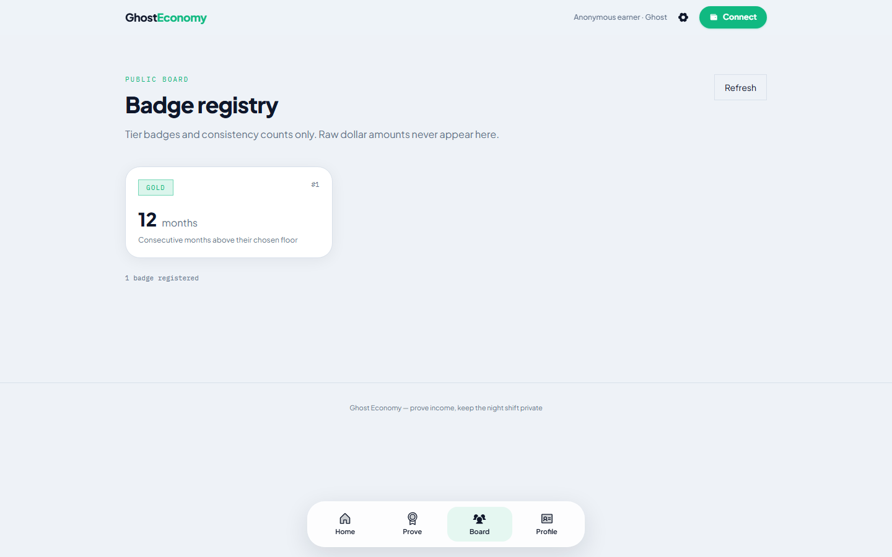

# Ghost Economy

ZK-verified private proof-of-income for the gig economy on [Midnight Network](https://midnight.network). Workers prove income stability against a floor without revealing dollar amounts, platforms, or individual transactions.

**Live dApp (Preview):** [https://ghosteconomy.vercel.app](https://ghosteconomy.vercel.app)  
**Live demo video:** [Watch on YouTube](https://youtu.be/8SXWbeyvi98)

| Level | Codename | Status |
|-------|----------|--------|
| L1 | New Moon | Complete |
| L2 | Waxing Crescent | Complete |
| **L3** | **First Quarter** | **Complete** |

## Screenshots

### Landing (desktop)


### Badge registry (desktop)



### Landing (mobile)


## Preview deployment

| Field | Value |
|-------|--------|
| Network | `preview` |
| Frontend | [ghosteconomy.vercel.app](https://ghosteconomy.vercel.app) |
| Demo video | [YouTube](https://youtu.be/8SXWbeyvi98) |
| Contract address | `55de4ffd42d3e55924c40a46d55a3e69074a1282f2a0a8d072fec29e699bc0ec` |
| Indexer | `https://indexer.preview.midnight.network/api/v4/graphql` |
| ZK assets | `/zk/ghost-economy` |

Config source: [`web/src/config.ts`](web/src/config.ts). Connect **Lace** or **1AM** on **preview**.

## Test output (4 tests passing)

```text
fahmin@Defiance15:~/midnight/ghosteconomy$ yarn test:local
yarn run v1.22.22
$ MIDNIGHT_NETWORK=undeployed yarn test
$ NODE_OPTIONS='--experimental-vm-modules' vitest run

 RUN  v3.2.4 /home/fahmin/midnight/ghosteconomy

 ✓ src/test/ghost-economy.test.ts (4)
   ✓ Ghost Economy Contract (4)
     ✓ deploys the contract
     ✓ registers income profile with disclosed commitments only
     ✓ rejects duplicate profile registration
     ✓ rejects insufficient income consistency

 Test Files  1 passed (1)
      Tests  4 passed (4)
   Start at  03:13:08
   Duration  52.64s

Done in 53.41s.
```

Full dump: [`docs/screenshots/test-passing.txt`](docs/screenshots/test-passing.txt).

## Privacy claim

| Data | Visibility | Where |
|------|------------|-------|
| `workerSecret` | **Private** | Witness + local private state |
| Monthly income vector (12 months) | **Private** | Witness only |
| `profileCommitment` | **Public** | `profiles` map key |
| `workerCommitment` | **Public** | `ProfileEntry.workerCommitment` |
| `incomeTier` (0–3) | **Public** | Coarse Bronze / Silver / Gold |
| `consistencyMonths` | **Public** | Consecutive months above floor |

**What an observer learns:** a worker registered at a disclosed floor with a tier badge and consistency count. They cannot recover monthly dollars, platforms, or transactions from chain data alone.

## Circuits

| Circuit | Purpose |
|---------|---------|
| `registerIncomeProfile(minMonthlyCents, requiredMonths)` | Prove incomes ≥ floor; disclose tier + consistency |
| `workerCommitment` / `profileCommitment` | Pure commitment helpers |

Tier buckets: Bronze ≥ 3 months, Silver ≥ 6, Gold ≥ 12.

## Quick start

```bash
nvm use 22
yarn install
yarn compile
yarn env:up
yarn test:local
yarn sync:zk
yarn web:dev          # http://127.0.0.1:5173
```

| Script | Purpose |
|--------|---------|
| `yarn test:local` | Integration tests on undeployed |
| `yarn deploy:preview` | Deploy contract to preview |
| `yarn web:build` | Production Vite build (`web/` → Vercel root) |
| `yarn sync:zk` | Copy managed ZK assets into `web/public` |

## Project structure

```
contracts/   Compact + managed ZK artifacts
api/         Shared contract helpers
src/         Wallet, deploy, vitest
web/         React 19 + Vite dApp (Vercel root directory)
```

## Toolchain

| Component | Version |
|-----------|---------|
| Node.js | 22+ |
| Compact | 0.31.1 |
| compact-runtime | 0.16.0 |
| compact-js | 2.5.1 |
| midnight-js | 4.1.1 |
| ledger-v8 | 8.1.0 |

## License

MIT
